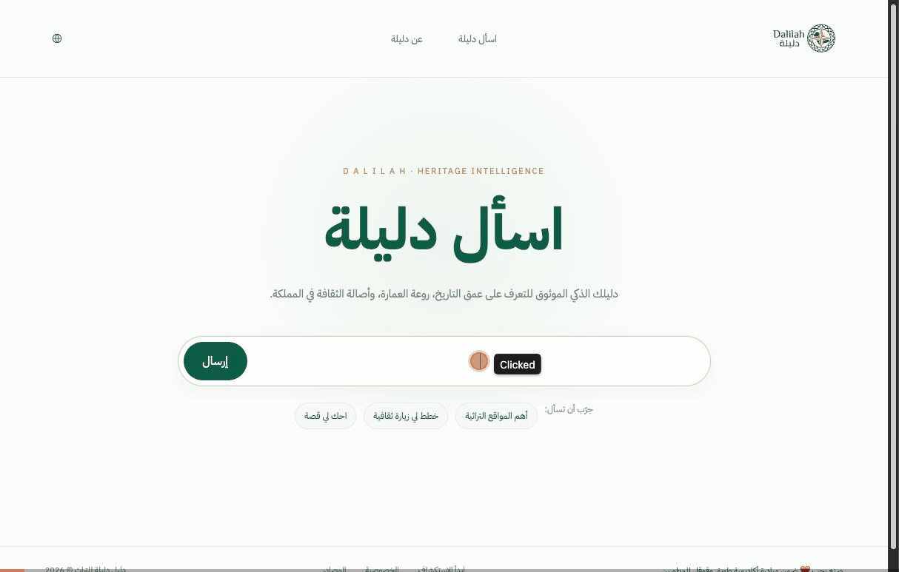
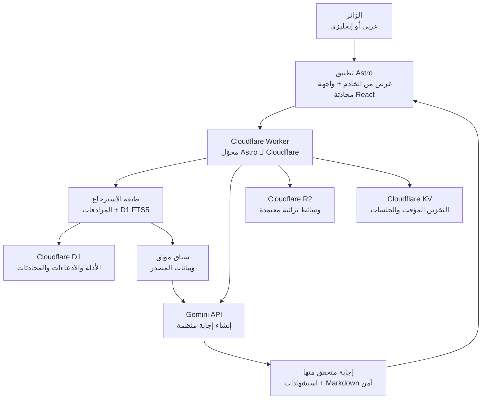
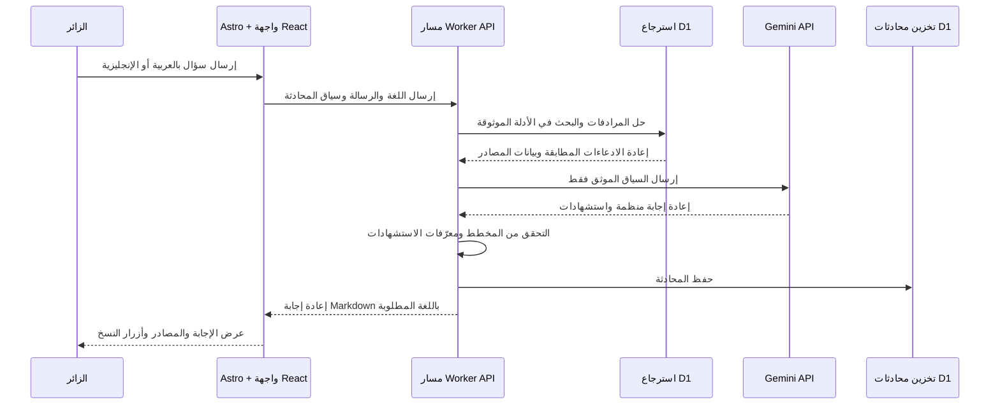
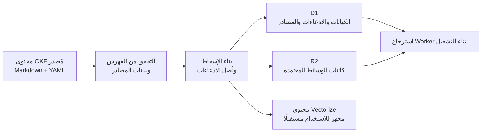

# دليلة · ذكاء التراث

<p align="center">
  
</p>

<p align="center">
  مساعد ثنائي اللغة، قائم على مصادر موثوقة، لاستكشاف تاريخ المملكة العربية السعودية وعمارتها وثقافتها ومعالمها.
</p>

<p align="center">
  <a href="https://dalilah.rha.sa/">التجربة المباشرة</a> ·
  <a href="https://github.com/raddah/Dalilah/releases/tag/v0.1.0">أحدث إصدار</a> ·
  <a href="README.md">English</a>
</p>

## نبذة عن المشروع

تقدم دليلة إجابات باللغة العربية والإنجليزية حول التراث السعودي. تُنشأ كل إجابة بالاعتماد على أدلة مسترجعة وموثقة، وليس على معرفة النموذج العامة غير المقيدة. يعرض التطبيق الاستشهادات، ويحافظ على لغة المستخدم، ويقدم إجابة واضحة عند عدم كفاية الأدلة المتاحة.

تتوفر التجربة العامة عبر المسارين `/ar/` و`/en/`:

- يستخدم المسار العربي تخطيط RTL وبيانات وصفية وإجابات باللغة العربية.
- يستخدم المسار الإنجليزي تخطيط LTR وبيانات وصفية وإجابات باللغة الإنجليزية.
- لا يتصل المتصفح بـ Gemini مباشرة؛ إذ تتولى واجهة API من جهة الخادم عمليات الاسترجاع والوصول إلى النموذج والتحقق وتخزين المحادثات.

## أبرز الإمكانات

- تجارب ثنائية اللغة للصفحة الرئيسية والمحادثة وصفحة «عن دليلة».
- استرجاع يبدأ بالمرادفات ويستخدم D1 FTS5 ضمن قاعدة معرفة تراثية منتقاة.
- إجابات منظمة من Gemini تتضمن درجة ثقة واستشهادات قابلة للتتبع.
- عرض آمن لـ Markdown وGitHub-Flavored Markdown.
- تقديم الوسائط التراثية المعتمدة عبر R2 الخاص.
- تخزين الكيانات والمصادر والادعاءات والعلاقات والمحادثات في D1.
- استخدام مساحات KV للتخزين المؤقت والبيانات المرتبطة بالجلسات.
- محتوى معرفي مُصدر ومُدار عبر GitHub ثم يُسقط إلى مخازن التشغيل.

## المكدس التقني

| الطبقة | التقنية | الدور |
| --- | --- | --- |
| إطار الويب | Astro 7 + محول Astro لـ Cloudflare | الصفحات كاملة المكدس والعرض من الخادم وهدف النشر |
| واجهة المستخدم | React 19 Islands | تجربة المحادثة التفاعلية |
| اللغة | TypeScript | أنواع التطبيق وبيئة التشغيل |
| الذكاء الاصطناعي | Gemini API | إنشاء إجابات منظمة من الأدلة المسترجعة |
| التنفيذ | Cloudflare Workers | واجهات API وبيئة التشغيل الطرفية |
| قاعدة البيانات | Cloudflare D1 | المصادر والكيانات والادعاءات والعلاقات والمحادثات |
| تخزين الكائنات | Cloudflare R2 | الصور والوثائق المعتمدة |
| التخزين المؤقت والجلسات | Cloudflare KV | بيانات منخفضة الكمون للتخزين المؤقت والجلسات |
| طبقة المعرفة | Markdown وYAML frontmatter وفهرس JSON | مصدر حقيقة قابل للقراءة والمراجعة |
| الأدوات | Wrangler وVitest وAstro Check | التطوير والنشر والاختبار والتحقق |

## البنية المعمارية

المخطط التالي مكتوب بصيغة Mermaid، ويمكن عرضه في صفحات GitHub وObsidian.



### تدفق الطلب أثناء التشغيل



### تدفق إسقاط قاعدة المعرفة



## بنية المشروع

```text
src/
├── components/       صفحات Astro وواجهة محادثة React
├── pages/             المسارات المحلية ومسارات API من الخادم
├── server/            خدمات الاسترجاع وGemini والمحادثات
└── env.d.ts           أنواع روابط Cloudflare
knowledge-base/       قاعدة المعرفة التراثية العربية والإنجليزية
migrations/           مخطط D1 وترحيلاته
scripts/               أدوات التحقق وإسقاط قاعدة المعرفة
public/                أصول الهوية والصور العامة
wrangler.jsonc         إعداد Worker وروابط Cloudflare
```

## المتطلبات

- Node.js LTS.
- حساب Cloudflare.
- مصادقة Wrangler.
- مفتاح Gemini API من Google AI Studio أو Google Cloud.

## التشغيل المحلي

```bash
npm install
cp .dev.vars.example .dev.vars
npx wrangler login
npm run dev
```

أضف الأسرار المحلية إلى `.dev.vars`:

```dotenv
GEMINI_API_KEY="replace-me"
GEMINI_MODEL="gemini-3.5-flash"
```

لا ترفع `.dev.vars` أو `.env` أو أي مفاتيح سرية إلى المستودع.

## إعداد Cloudflare Worker

يُستخدم Wrangler كأداة المشروع لتطوير Worker وإعداده ونشره. يحتوي المستودع مسبقًا على ملف `wrangler.jsonc` الذي يعرّف اسم Worker وتاريخ التوافق والأصول والرصد وروابط D1 وR2 وKV.

لإنشاء مشروع Worker جديد من مجلد فارغ:

```bash
npm create cloudflare@latest
```

أما لهذا المستودع، فثبّت الاعتمادات وسجّل الدخول محليًا:

```bash
npm install
npx wrangler login
```

أنشئ موارد Cloudflare أو اربط الموارد الموجودة:

```bash
npx wrangler d1 create dalilah-db
npx wrangler r2 bucket create dalilah-media
npx wrangler kv namespace create CACHE
npx wrangler kv namespace create SESSION
```

انسخ المعرّفات الناتجة إلى `wrangler.jsonc`، ثم أنشئ أنواع روابط Cloudflare:

```bash
npm run cf-typegen
```

طبّق ترحيلات D1 محليًا:

```bash
npx wrangler d1 migrations apply dalilah-db --local
```

لا تطبق الترحيلات على قاعدة البيانات البعيدة إلا بعد مراجعة البيئة المستهدفة:

```bash
npx wrangler d1 migrations apply dalilah-db --remote
```

أضف أسرار الإنتاج عبر Wrangler:

```bash
npx wrangler secret put GEMINI_API_KEY
npx wrangler secret put GEMINI_MODEL
```

## سير عمل المعرفة

1. أضف أو حدّث المحتوى التراثي المعتمد داخل `knowledge-base/okf/`.
2. اجعل بيانات المصدر ونسخ اللغات والادعاءات والعلاقات واضحة وصريحة.
3. تحقّق من الفهرس وابنِ إسقاط التشغيل.
4. راجع تغييرات D1 والوسائط الناتجة قبل تطبيقها.
5. استرجع الأدلة قبل استدعاء Gemini وأرفق الاستشهادات بكل إجابة واقعية.

```bash
npm run build:knowledge
npx wrangler d1 migrations apply dalilah-db --local
npx wrangler d1 execute dalilah-db --local --file generated/okf-projection.sql
```

يُعد `knowledge-base/okf/catalog.json` الفهرس القابل للقراءة آليًا. وتجعل معرّفات الادعاءات والمصادر الثابتة عمليات الإسقاط قابلة لإعادة الإنتاج والتدقيق.

## التحقق

```bash
npm run check
npm run typecheck
npm test
npm run build
```

## النشر

يبني أمر النشر تطبيق Astro ثم ينشر حزمة Worker الناتجة:

```bash
npm run deploy
```

بعد النشر، تحقق من نقطة فحص الصحة:

```text
https://YOUR_DOMAIN/api/health
```

## النطاق الحالي والقيود

- يستخدم الاسترجاع أثناء التشغيل حاليًا المرادفات وD1 FTS5 بدلًا من التضمينات الدلالية.
- يجهّز `generated/vectorize-corpus.ndjson` سجلات ثابتة لتكامل Vectorize مستقبلًا.
- صفحة الإدارة وخدمة BaaS خارج نطاق إصدار MVP الحالي.
- تُدار المعرفة عبر ملفات مُصدرة ومراجعة GitHub.

## مبادئ الأمان

- احفظ بيانات Gemini السرية في أسرار Worker من جهة الخادم.
- تحقّق من أجسام الطلبات وحدد أحجام الرسائل والملفات.
- أبقِ R2 خاصًا ما لم تتم الموافقة صراحة على أصل عام.
- لا تسمح للنموذج باختراع استشهادات خارج مجموعة الأدلة المسترجعة.
- أعد إجابة تفيد بعدم كفاية الأدلة بدلًا من التخمين.

## مراجع Cloudflare الرسمية

- [البدء مع Workers](https://developers.cloudflare.com/workers/get-started/)
- [تثبيت Wrangler وتحديثه](https://developers.cloudflare.com/workers/wrangler/install-and-update/)
- [إعداد Wrangler](https://developers.cloudflare.com/workers/wrangler/configuration/)
- [أوامر Wrangler](https://developers.cloudflare.com/workers/wrangler/commands/)
- [البدء مع D1](https://developers.cloudflare.com/d1/get-started/)
- [Workers API لـ R2](https://developers.cloudflare.com/r2/get-started/workers-api/)
- [البدء مع Workers KV](https://developers.cloudflare.com/kv/get-started/)

## الإصدار

الإصدار الحالي من MVP هو [v0.1.0](https://github.com/raddah/Dalilah/releases/tag/v0.1.0).

## مصادر النماذج وOKF والأبحاث

### طبقة معرفة دليلة بصيغة OKF

تستخدم دليلة طبقة معرفة ثنائية اللغة ومُصدرة بالإصدارات، مبنية على Markdown وYAML frontmatter وفهرس JSON متحقق منه. تربط طبقة OKF في المشروع كل ادعاء برابط مصدر وبيانات التحقق ومعرّف ثابت للادعاء.

- [قاعدة معرفة دليلة بصيغة OKF](knowledge-base/okf/README.md)
- [فهرس قاعدة المعرفة](knowledge-base/okf/catalog.json)
- [سجل المصادر الموثوقة](knowledge-base/okf/en/01-source-inventory.md)

### Open Knowledge Format (OKF)

- [التعريف بصيغة Open Knowledge Format — Google Cloud](https://cloud.google.com/blog/products/data-analytics/how-the-open-knowledge-format-can-improve-data-sharing)
- [الإصدار OKF v0.2 وإشارات الثقة — Google Cloud](https://cloud.google.com/blog/products/data-analytics/okf-v0-2-adds-trust-signals)
- [المواصفة الرسمية لـ Open Knowledge Format v0.2](https://github.com/GoogleCloudPlatform/knowledge-catalog/blob/main/okf/SPEC.md)
- [مستودع Knowledge Catalog من GoogleCloudPlatform](https://github.com/GoogleCloudPlatform/knowledge-catalog/tree/main/okf)

### Google AI والنماذج المستخدمة

- [البدء السريع مع Google AI Studio](https://ai.google.dev/gemini-api/docs/ai-studio-quickstart)
- [مرجع Gemini API](https://ai.google.dev/api)
- [توثيق نموذج Gemini 3.5 Flash](https://ai.google.dev/gemini-api/docs/models/gemini-3.5-flash)
- [المخرجات المنظمة في Gemini](https://ai.google.dev/gemini-api/docs/structured-output)
- [البحث العلمي: عائلة نماذج Gemini متعددة القدرات](https://arxiv.org/abs/2312.11805)

النموذج المعرّف في المشروع هو `gemini-3.5-flash`، ويمكن التحكم به عبر متغير البيئة `GEMINI_MODEL`. لا يستخدم التشغيل الحالي نموذج تضمينات؛ إذ جرى تجهيز محتوى Vectorize لمرحلة مستقبلية.

### مراجع الاسترجاع وقاعدة البيانات

- [بحث Retrieval-Augmented Generation للمهام المعتمدة على المعرفة](https://arxiv.org/abs/2005.11401)
- [امتداد SQLite FTS5](https://sqlite.org/fts5.html)

### مرجع مجتمعي

- [OKF + RAG: بنية معمارية متكاملة لوكلاء الذكاء الاصطناعي](https://medium.com/@ravishkhullar/okf-rag-the-ultimate-ai-agent-architecture-26b9ceed44f1)
