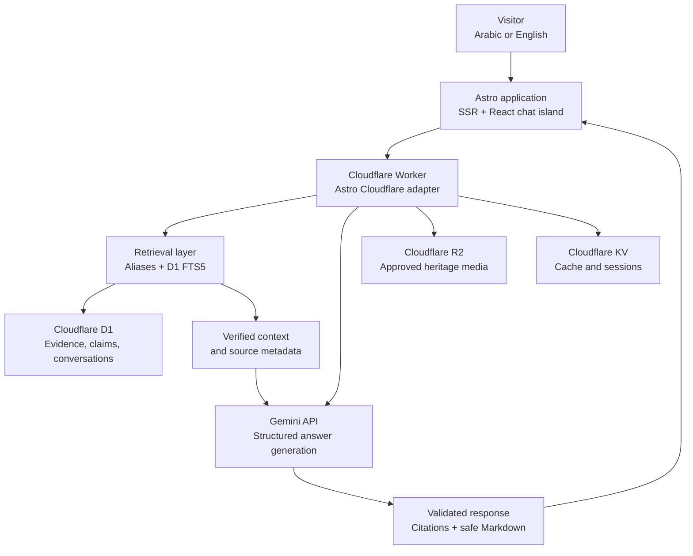
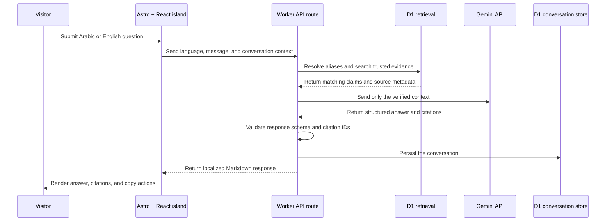
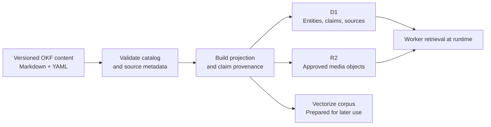

# Dalilah · Heritage Intelligence

<p align="center">
  
</p>

<p align="center">
  A bilingual, source-grounded Saudi heritage assistant for discovering history, architecture, culture, and places across the Kingdom.
</p>

<p align="center">
  <a href="https://dalilah.rha.sa/">Live demo</a> ·
  <a href="https://github.com/raddah/Dalilah/releases/tag/v0.1.0">Latest release</a> ·
  <a href="README.ar.md">العربية</a>
</p>

## Overview

Dalilah provides Arabic and English answers about Saudi heritage. Each response is generated from retrieved, verified evidence instead of open-ended model knowledge. The application presents citations, preserves the selected language, and returns a clear fallback when the available evidence is insufficient.

The public experience is available at `/ar/` and `/en/`:

- Arabic uses RTL layout, Arabic metadata, and Arabic answers.
- English uses LTR layout, English metadata, and English answers.
- The browser never calls Gemini directly; the server-side API route handles retrieval, model access, validation, and conversation storage.

## Key capabilities

- Bilingual Arabic-English landing, chat, and about experiences.
- Alias-first and D1 FTS5 retrieval over a curated heritage knowledge base.
- Structured Gemini responses with confidence and traceable citations.
- Safe Markdown and GitHub-Flavored Markdown rendering.
- Private R2 delivery for approved heritage media.
- D1 persistence for entities, sources, claims, relationships, and conversations.
- KV namespaces for cache and session-related data.
- Versioned knowledge content maintained in GitHub and projected into runtime storage.

## Technology stack

| Layer | Technology | Role |
| --- | --- | --- |
| Web framework | Astro 7 + Astro Cloudflare adapter | Full-stack pages, server rendering, and deployment target |
| UI | React 19 islands | Interactive chat experience |
| Language | TypeScript | Application and runtime types |
| AI | Gemini API | Structured answers from retrieved evidence |
| Compute | Cloudflare Workers | Server-side API and edge runtime |
| Database | Cloudflare D1 | Sources, entities, claims, relationships, and conversations |
| Object storage | Cloudflare R2 | Approved images and documents |
| Cache and sessions | Cloudflare KV | Low-latency cached and session-oriented data |
| Knowledge layer | Markdown, YAML frontmatter, and JSON catalog | Human-readable, reviewable source of truth |
| Tooling | Wrangler, Vitest, Astro Check | Development, deployment, testing, and validation |

## Architecture

This diagram is written in Mermaid so it can be rendered in GitHub README pages and Obsidian.



### Runtime request flow



### Knowledge projection flow



## Project structure

```text
src/
├── components/       Astro pages and React chat island
├── pages/             Localized routes and server API routes
├── server/            Retrieval, Gemini, and conversation services
└── env.d.ts           Cloudflare binding types
knowledge-base/       Curated Arabic-English heritage knowledge
migrations/           D1 schema and data migrations
scripts/               Validation and knowledge projection utilities
public/                Brand assets and public images
wrangler.jsonc         Cloudflare Worker and binding configuration
```

## Requirements

- Node.js LTS.
- A Cloudflare account.
- Wrangler authentication.
- A Gemini API key from Google AI Studio or Google Cloud.

## Local development

```bash
npm install
cp .dev.vars.example .dev.vars
npx wrangler login
npm run dev
```

Set the local secrets in `.dev.vars`:

```dotenv
GEMINI_API_KEY="replace-me"
GEMINI_MODEL="gemini-3.5-flash"
```

Never commit `.dev.vars`, `.env`, or API keys.

## Cloudflare Worker setup

Wrangler is the project CLI used to develop, configure, and deploy the Worker. The repository already contains `wrangler.jsonc` with the Worker name, compatibility date, assets, observability, D1, R2, and KV bindings.

Create a new Worker project when starting from an empty directory:

```bash
npm create cloudflare@latest
```

For this repository, install dependencies and authenticate locally:

```bash
npm install
npx wrangler login
```

Create or connect the Cloudflare resources:

```bash
npx wrangler d1 create dalilah-db
npx wrangler r2 bucket create dalilah-media
npx wrangler kv namespace create CACHE
npx wrangler kv namespace create SESSION
```

Copy the returned IDs into `wrangler.jsonc`, then generate Cloudflare binding types:

```bash
npm run cf-typegen
```

Apply D1 migrations locally:

```bash
npx wrangler d1 migrations apply dalilah-db --local
```

Apply migrations to the remote database only after reviewing the target environment:

```bash
npx wrangler d1 migrations apply dalilah-db --remote
```

Set production secrets through Wrangler:

```bash
npx wrangler secret put GEMINI_API_KEY
npx wrangler secret put GEMINI_MODEL
```

## Knowledge workflow

1. Add or update approved heritage content in `knowledge-base/okf/`.
2. Keep source metadata, language variants, claims, and relationships explicit.
3. Validate the catalog and build the runtime projection.
4. Review the generated D1 and media changes before applying them.
5. Retrieve evidence before calling Gemini and return citations with every factual answer.

```bash
npm run build:knowledge
npx wrangler d1 migrations apply dalilah-db --local
npx wrangler d1 execute dalilah-db --local --file generated/okf-projection.sql
```

`knowledge-base/okf/catalog.json` is the machine-readable catalog. Stable claim IDs and source IDs make projections reproducible and auditable.

## Validation

```bash
npm run check
npm run typecheck
npm test
npm run build
```

## Deployment

The deployment script builds the Astro application and deploys the generated Worker bundle:

```bash
npm run deploy
```

After deployment, verify the health endpoint:

```text
https://YOUR_DOMAIN/api/health
```

## Current scope and limitations

- Runtime retrieval currently uses aliases and D1 FTS5 rather than semantic embeddings.
- `generated/vectorize-corpus.ndjson` prepares stable records for a future Vectorize integration.
- An Admin page and external BaaS are outside the current MVP scope.
- Knowledge is curated through version-controlled files and GitHub review.

## Security principles

- Keep Gemini credentials server-side in Worker secrets.
- Validate request bodies and limit message and upload sizes.
- Keep R2 private unless a public asset is explicitly approved.
- Do not allow the model to invent citations outside the retrieved evidence set.
- Return an insufficient-evidence response instead of guessing.

## Official Cloudflare references

- [Workers getting started](https://developers.cloudflare.com/workers/get-started/)
- [Install and update Wrangler](https://developers.cloudflare.com/workers/wrangler/install-and-update/)
- [Wrangler configuration](https://developers.cloudflare.com/workers/wrangler/configuration/)
- [Wrangler commands](https://developers.cloudflare.com/workers/wrangler/commands/)
- [D1 getting started](https://developers.cloudflare.com/d1/get-started/)
- [R2 Workers API](https://developers.cloudflare.com/r2/get-started/workers-api/)
- [Workers KV getting started](https://developers.cloudflare.com/kv/get-started/)

## Release

The current MVP release is [v0.1.0](https://github.com/raddah/Dalilah/releases/tag/v0.1.0).

## Sources, models, and research references

### Dalilah OKF knowledge layer

Dalilah uses a versioned bilingual knowledge layer based on Markdown, YAML frontmatter, and a validated JSON catalog. The project’s OKF implementation keeps each claim linked to a source URL, verification metadata, and a stable claim ID.

- [Dalilah OKF Knowledge Base](knowledge-base/okf/README.md)
- [Knowledge Base Catalog](knowledge-base/okf/catalog.json)
- [Trusted Source Inventory](knowledge-base/okf/en/01-source-inventory.md)

### Open Knowledge Format (OKF)

- [Introducing the Open Knowledge Format — Google Cloud](https://cloud.google.com/blog/products/data-analytics/how-the-open-knowledge-format-can-improve-data-sharing)
- [OKF v0.2 Adds Trust Signals — Google Cloud](https://cloud.google.com/blog/products/data-analytics/okf-v0-2-adds-trust-signals)
- [Open Knowledge Format v0.2 Specification](https://github.com/GoogleCloudPlatform/knowledge-catalog/blob/main/okf/SPEC.md)
- [GoogleCloudPlatform Knowledge Catalog — OKF Repository](https://github.com/GoogleCloudPlatform/knowledge-catalog/tree/main/okf)

### Google AI and model references

- [Google AI Studio Quickstart](https://ai.google.dev/gemini-api/docs/ai-studio-quickstart)
- [Gemini API Reference](https://ai.google.dev/api)
- [Gemini 3.5 Flash Model Documentation](https://ai.google.dev/gemini-api/docs/models/gemini-3.5-flash)
- [Gemini Structured Outputs](https://ai.google.dev/gemini-api/docs/structured-output)
- [Gemini: A Family of Highly Capable Multimodal Models](https://arxiv.org/abs/2312.11805)

The configured model is `gemini-3.5-flash`, controlled through the `GEMINI_MODEL` environment variable. No embedding model is used at runtime yet; the Vectorize corpus is prepared for a future phase.

### Retrieval and database references

- [Retrieval-Augmented Generation for Knowledge-Intensive NLP Tasks](https://arxiv.org/abs/2005.11401)
- [SQLite FTS5 Extension](https://sqlite.org/fts5.html)

### Community reference

- [OKF + RAG: The Ultimate AI Agent Architecture](https://medium.com/@ravishkhullar/okf-rag-the-ultimate-ai-agent-architecture-26b9ceed44f1)
